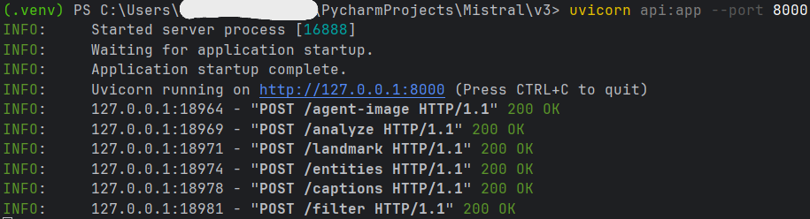
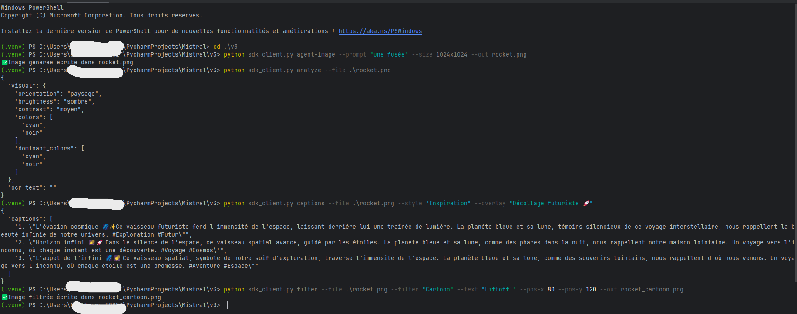
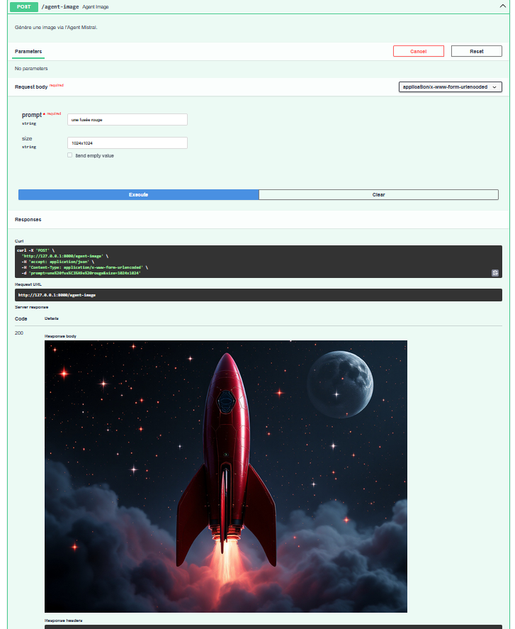
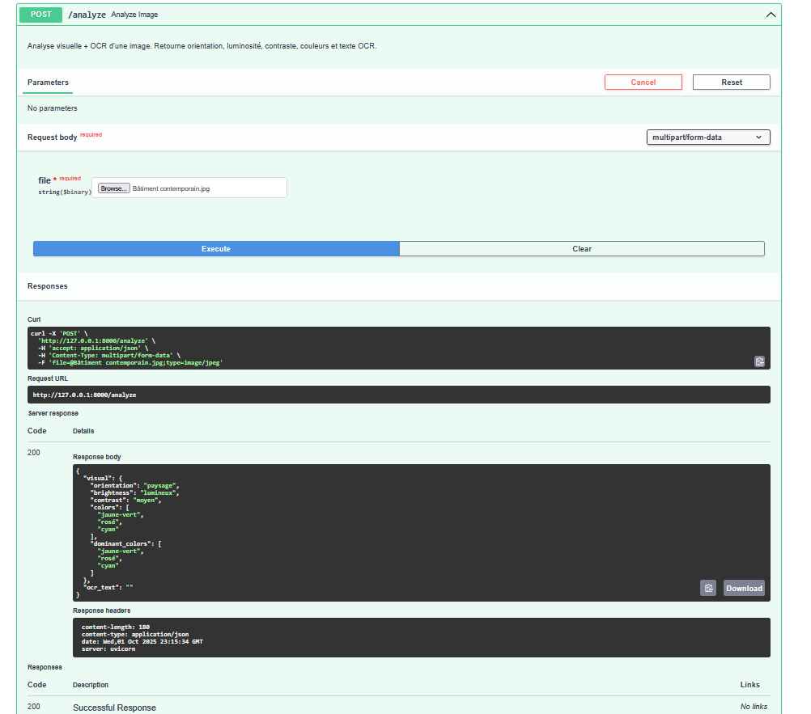
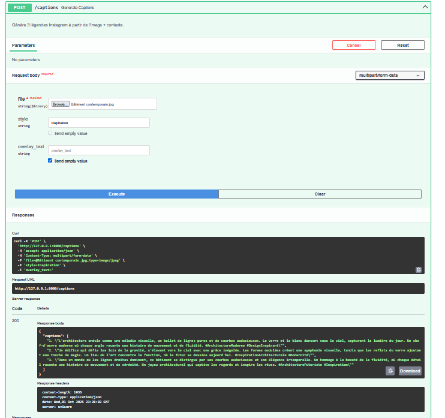
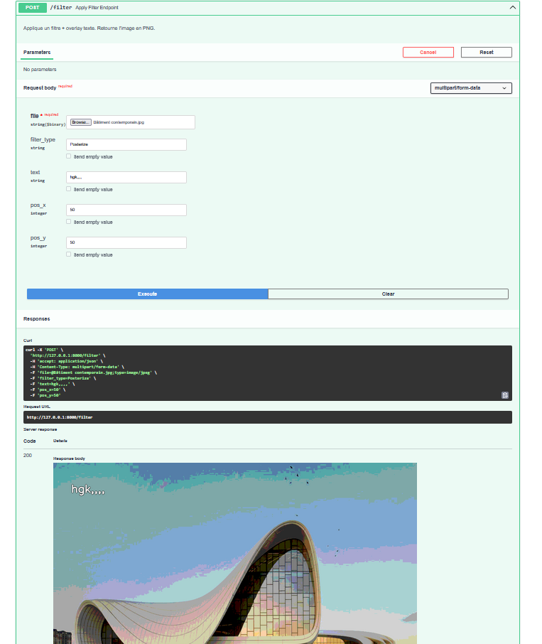
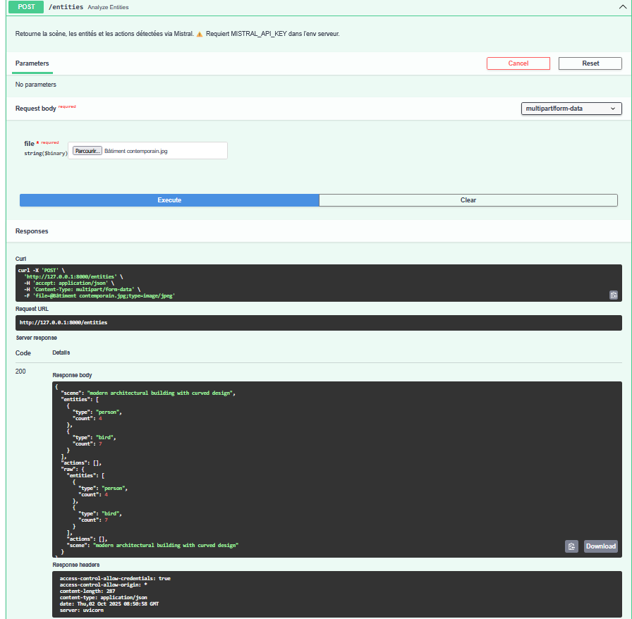
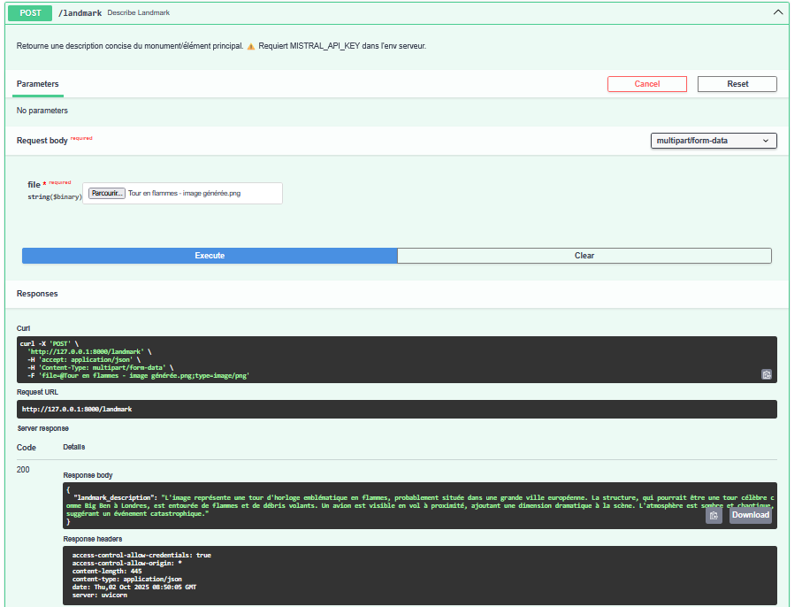

# CaptionCrafter — Générateur de légendes (Vision + OCR + Filtres + Agent Mistral)


**V3 (FastAPI)** : service HTTP avec endpoints  
`/analyze`, `/captions`, `/filter`, `/agent-image`, **`/landmark`**, **`/entities`**  
**V2 (Streamlit)** : petite UI pour tester Vision/OCR/Filtres/Agent  
**SDK client (CLI)** : mini client pour piloter l’API depuis le terminal

---

## Sommaire

1. [Structure du dépôt](#structure-du-dépôt)  
2. [Installation](#installation)  
3. [Variables d’environnement](#variables-denvironnement)  
4. [Démarrer l’API (V3)](#démarrer-lapi-v3)  
5. [SDK client (CLI)](#sdk-client-cli)  
6. [Tests rapides (PowerShell)](#tests-rapides-powershell)  
7. [Références endpoints](#références-endpoints)  
8. [Lancer l’app Streamlit (V2)](#lancer-lapp-streamlit-v2)  
9. [Dépannage](#dépannage)  
10. [Licence & Auteur](#licence--auteur)

---

## Structure du dépôt

```
.
├── api.py             # Serveur FastAPI (API V3)
├── mistral_api.py     # Appels Mistral (texte/vision/agent image)
├── image_utils.py     # OCR + analyse visuelle (OpenCV/PIL/Tesseract)
├── filters.py         # Filtres + overlay texte (OpenCV + PIL)
├── sdk_client.py      # Mini SDK client (CLI) 
├── main.py            # App Streamlit (V2)
├── images/            # Exemples / sorties
├── requirements.txt   # Dépendances
├── .env_exemple       # Exemple d’environnement
└── README.md
```

---

## Installation

```bash
git clone https://github.com/Armarit78/CaptionCrafter-Generateur-de-legendes.git
cd CaptionCrafter-Generateur-de-legendes

# Créer l’environnement virtuel
python -m venv .venv

# Windows (PowerShell)
. .\.venv\Scripts\Activate.ps1

# macOS / Linux
source .venv/bin/activate

# Installer les dépendances
pip install -r requirements.txt
```

**Extrait conseillé de `requirements.txt` :**
```
fastapi
uvicorn
streamlit==1.36.0
streamlit-drawable-canvas==0.9.3
opencv-contrib-python-headless==4.10.0.84
pillow==10.4.0
requests==2.32.3
python-dotenv==1.0.1
pytesseract==0.3.10
numpy==1.26.4
python-multipart==0.0.20
```
> `python-multipart` est requis pour les uploads `multipart/form-data` de FastAPI.

---

## Variables d’environnement

Créer un fichier **`.env`** (à la racine) :

```
MISTRAL_API_KEY=sk-xxx_ta_cle_xxx
# Optionnel si Tesseract n'est pas dans le PATH :
# TESSERACT_CMD=C:\Program Files\Tesseract-OCR	esseract.exe
```

**Windows (PowerShell) — session courante :**
```powershell
$env:MISTRAL_API_KEY = "sk-xxx_ta_cle_xxx"
```

**macOS / Linux :**
```bash
export MISTRAL_API_KEY="sk-xxx_ta_cle_xxx"
```

---

## Démarrer l’API (V3)

Depuis la **racine** du projet :

```bash
uvicorn api:app --port 8000
```

- Accueil : `http://127.0.0.1:8000/`  
- Docs (Swagger) : `http://127.0.0.1:8000/docs`  
- Santé : `http://127.0.0.1:8000/health`

Réponse attendue à l’accueil :
```json
{ "message": "✅ CaptionCrafter API v3 is running", "docs": "/docs", "health": "/health" }
```

---

## SDK client (CLI)

Le mini SDK (`sdk_client.py`) est un **client CLI** pour appeler l’API sans écrire de code Python.

### Utilisation

```bash
python sdk_client.py [commande] [options]
```

### Commandes disponibles

- `agent-image` : génère une image (endpoint `/agent-image`)
- `analyze` : analyse visuelle + OCR (endpoint `/analyze`)
- `captions` : génère 3 légendes Instagram (endpoint `/captions`)
- `filter` : applique un filtre + texte (endpoint `/filter`)
- `landmark` : description du monument / élément principal (endpoint **`/landmark`**)
- `entities` : scène + entités / actions détectées (endpoint **`/entities`**)

### Aide intégrée

```bash
python sdk_client.py --help
python sdk_client.py agent-image --help
```

---

## Tests rapides (PowerShell)

> **Pré-requis** : serveur lancé (`uvicorn api:app --port 8000`) et `$env:MISTRAL_API_KEY` défini.

```powershell
# 1) Génération image (Agent Mistral)
python sdk_client.py agent-image --prompt "une fusée" --size 1024x1024 --out rocket.png
# => Image générée écrite dans rocket.png
# ⚠️ Si "429 Too Many Requests" : tu as atteint le rate limit du modèle image. Attends un peu ou passe sur un plan/quota supérieur.

# 2) Analyse (vision + OCR)
python sdk_client.py analyze --file .\images\rocket.png
# => JSON "visual" (orientation, brightness, contrast, colors...) + "ocr_text"

# 3) Légendes Instagram
python sdk_client.py captions --file .\images\rocket.png --style "Inspiration" --overlay "Décollage futuriste 🚀"
# => 3 propositions (JSON "captions")

# 4) Filtre + overlay texte
python sdk_client.py filter --file .\images\rocket.png --filter "Cartoon" --text "Liftoff!" --pos-x 80 --pos-y 120 --out .\images\rocket_cartoon.png
# => Image filtrée écrite dans .\images\rocket_cartoon.png

# 5) Description de monument/élément principal
python sdk_client.py landmark --file .\images\rocket.png
# => Texte décrivant un monument/élément marquant détecté (si pertinent)

# 6) Scène & entités (objets, actions)
python sdk_client.py entities --file .\images\rocket.png
# => JSON avec { scene, entities[], actions[] }
```

---

## Références endpoints

| Méthode | Route           | Corps (form-data / x-www-form-urlencoded)                              | Réponse                            |
|--------:|-----------------|-------------------------------------------------------------------------|------------------------------------|
| POST    | `/analyze`      | `file=@image`                                                           | JSON { visual, ocr_text }          |
| POST    | `/captions`     | `file=@image`, `style`(opt), `overlay_text`(opt)                        | JSON { captions: [..] }            |
| POST    | `/filter`       | `file=@image`, `filter_type`, `text`(opt), `pos_x/pos_y`(opt)           | `image/png`                        |
| POST    | `/agent-image`  | `prompt`, `size` (`512x512`, `1024x1024`, …)                            | `image/png`                        |
| POST    | `/landmark`     | `file=@image`                                                           | JSON { description }               |
| POST    | `/entities`     | `file=@image`                                                           | JSON { scene, entities, actions }  |
| GET     | `/health`       | —                                                                       | `{ "status": "ok" }`               |
| GET     | `/docs`         | —                                                                       | Swagger UI                         |

---

## 📸 Aperçu visuel

<p align="center">
  <br>
  <em>1) Serveur Uvicorn opérationnel — endpoints prêts, retours 200 OK.</em>
</p>

<p align="center">
  <br>
  <em>2) Parcours CLI — génération d’image, analyse, légendes, filtre.</em>
</p>

<p align="center">
  <br>
  <em>3) Résultat de la génération — fusée rouge, lune, nuages (1024×1024).</em>
</p>

<p align="center">
  <br>
  <em>4) Endpoint <code>/analyze</code> — orientation, couleurs dominantes, OCR.</em>
</p>

<p align="center">
  <br>
  <em>5) Endpoint <code>/captions</code> — 3 légendes FR contextualisées.</em>
</p>

<p align="center">
  <br>
  <em>6) Endpoint <code>/filter</code> — effet « Posterize » + texte incrusté.</em>
</p>

<p align="center">
  <br>
  <em>7) Endpoint <code>/entities</code> — scène, entités (person, bird…), actions.</em>
</p>

<p align="center">
  <br>
  <em>8) Endpoint <code>/landmark</code> — description concise de l’élément principal.</em>
</p>

---

## Lancer l’app Streamlit (V2)

Depuis la **racine** du projet :

```bash
streamlit run main.py
```

---

## Dépannage

- **`Clé API Mistral non trouvée (MISTRAL_API_KEY)`**  
  Assure-toi que la variable est définie **avant** de lancer le serveur :  
  - PowerShell : `echo $env:MISTRAL_API_KEY`  
  - macOS/Linux : `echo $MISTRAL_API_KEY`  
  Ou crée un `.env` à la racine.

- **`Form data requires "python-multipart" to be installed`**  
  `pip install python-multipart==0.0.20`

- **Tesseract introuvable**  
  Installer Tesseract (Windows : `choco install tesseract`) et/ou renseigner `TESSERACT_CMD` dans `.env`.

- **`429 Too Many Requests` sur `/agent-image`**  
  C’est un **rate-limit** côté Mistral pour le modèle d’**image generation**.  
  Attends, réduis la cadence des appels, ou passe sur un **plan/quota** supérieur dans le dashboard Mistral.

---

## Licence & Auteur

- Auteur : **Armarit78** - © 2025
