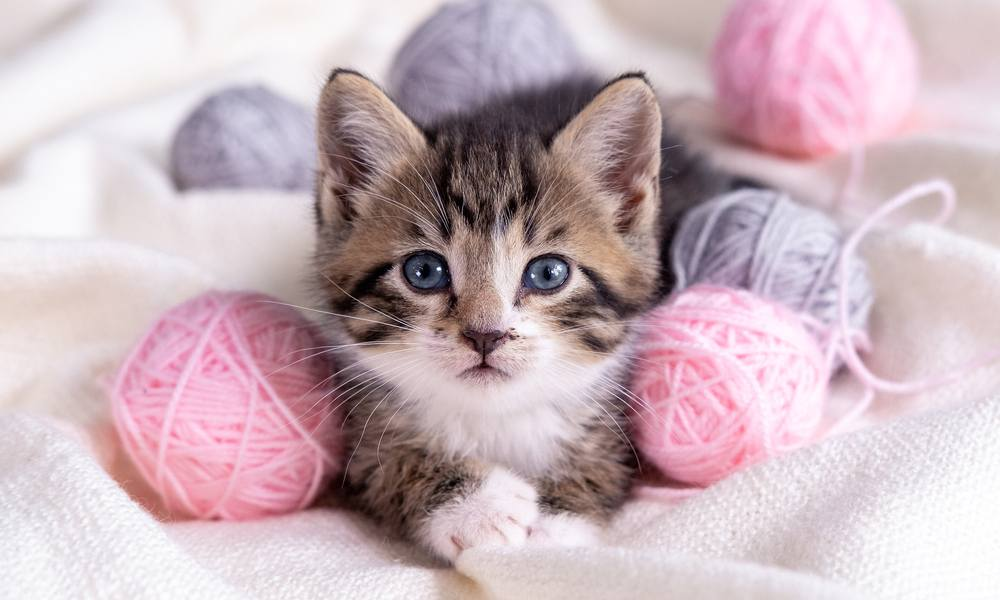
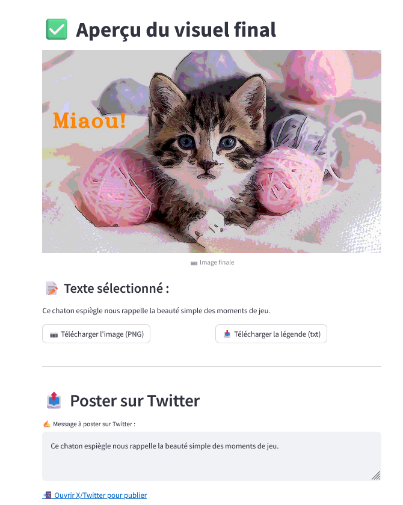

# CaptionCrafter — Générateur de légendes (Vision + OCR + Filtres)

**V1 — sans SDK Mistral (HTTP pur via `requests`)**  
Application **Python + Streamlit** qui génère **exactement 3 légendes courtes** ancrées sur le **contenu réel de l’image**.  
Le modèle reçoit un **contexte factuel** (OCR, descripteurs visuels, couleurs dominantes, orientation, luminosité/contraste, texte overlay éventuel) et produit des textes **pertinents, concis et publiables**.

> Projet préparé pour la candidature Mistral AI. Objectifs : **installation simple**, **test rapide**, **robustesse**.

---

## ✨ Fonctionnalités

- **Analyse d’image locale**
  - **Pixtral (compréhension d’image, optionnel)** : envoie l’image en base64 via *chat completions* pour extraire un **descripteur compact** (scène, entités, actions). Ce signal sert à **ancrer** les légendes.
  - **OCR (Tesseract)** avec fallback sûr si non installé.
  - **Descripteurs visuels** rapides : orientation (portrait/paysage), luminosité, contraste, **couleurs dominantes** (k‑means).
- **Contrôles créatifs**
  - **Filtres** (Cartoon, Watercolor, Oil Paint, Pixelate, Pencil Sketch, etc.).
  - **Texte overlay** avec polices **Hershey** (OpenCV) et réglages (taille, couleur, épaisseur, position).
- **Génération ancrée**
  - Prompt **SYSTEM** qui **interdit les inventions** et impose 3 options ≤ 300 caractères.
  - Style paramétrable : *Inspiration, Humour, Émotion, Promotion, Citation*.
- **Expérience robuste**
  - **Retry/backoff** et **fallback de modèles** côté API Mistral (texte + vision).
  - **État Streamlit persistant** entre la création et l’aperçu final.
- **Export**
  - Téléchargement **PNG** du visuel et **TXT** de la légende choisie.

---

## 🧱 Pile technique

- UI : **Streamlit**
- Vision : **OpenCV**, **Pillow**, **Tesseract OCR** (facultatif mais recommandé)
- LLM : API **Mistral** (HTTP avec `requests`)
- Structure :
  - `main.py` — interface Streamlit et flux utilisateur
  - `mistral_api.py` — client API Mistral (HTTP + retry/fallback)
  - `image_utils.py` — OCR (Tesseract) + descripteurs visuels
  - `filters.py` — filtres d’image + rendu du texte

---

## 🚀 Installation rapide

### 1) Cloner et installer les dépendances
```bash
git clone https://github.com/Armarit78/CaptionCrafter-Generateur-de-legendes.git
cd CaptionCrafter-Generateur-de-legendes
python -m venv .venv && source .venv/bin/activate  # Windows: .venv\Scripts\activate
pip install -r requirements.txt
```

### 2) Installer **Tesseract‑OCR** (pour l’OCR)
CaptionCrafter **fonctionne sans Tesseract**, mais l’OCR améliore fortement l’ancrage des légendes.

- **Windows (recommandé)**  
  - Via **Chocolatey** :  
    ```powershell
    choco install tesseract
    ```
  - Ou via le dépôt officiel : https://github.com/tesseract-ocr/tesseract  
  - Si Tesseract n’est pas dans le `PATH`, créer un fichier `.env` à la racine et préciser :
    ```
    TESSERACT_CMD=C:\Program Files\Tesseract-OCR\tesseract.exe
    ```

- **macOS (Homebrew)**  
  ```bash
  brew install tesseract
  ```

- **Linux (Debian/Ubuntu)**  
  ```bash
  sudo apt-get update && sudo apt-get install -y tesseract-ocr
  ```

### 3) Clé API Mistral
Guide pour obtenir une clé Mistral : https://www.merge.dev/blog/mistral-ai-api-key

Créer un fichier `.env` à la racine :
```
MISTRAL_API_KEY=sk-xxxxxxxxxxxxxxxx
# Optionnel si Tesseract n'est pas dans le PATH Windows :
# TESSERACT_CMD=C:\Program Files\Tesseract-OCR\tesseract.exe
```

### 4) Lancer l’app
```bash
streamlit run main.py
```
Ouvrir l’URL locale affichée par Streamlit.  
Importer une image, choisir un style/filtre, **Générer**, puis **Prévisualiser** et **Télécharger**.

---


### 🔍 Compréhension d’image avec **Pixtral** (pas PixelAI)
- **But** : obtenir un **descripteur** (scène/entités/actions) pour **enrichir le contexte** de génération.
- **Comment** : appel au modèle **Pixtral** via l’endpoint **/v1/chat/completions** avec un `image_url` (base64).
- **Ce que ce n’est pas** : **PixelAI** (génération d’images) n’est **pas** utilisé dans cette V1.

## 🔧 Notes d’implémentation (V1)

- **`mistral_api.py`** implémente un appel **HTTP** robuste (`requests`) avec **backoff exponentiel** et **fallback de modèles** (texte et vision).
- **État Streamlit** : les paramètres (style, filtre, typo, curseurs) sont **sauvegardés** entre “Création” et “Aperçu final”.

> Une **V2** (branche séparée) proposera l’intégration via le **SDK `mistralai`** et/ou une **API FastAPI**.

---

## 📦 Dépendances

Voir `requirements.txt`.

---

## Aperçu visuel

Cette section illustre le **flux complet** : à partir de la photo d’origine, l’application produit un visuel stylisé avec un titre, puis génère une légende prête à poster.

<p align="center">
  <br>
  <em>1) Image d’origine.</em>
</p>

<p align="center">
  <br>
  <em>2) Rendu final — filtre artistique, ajout du titre « Miaou! », et génération de la légende.</em>
</p>

### Ce que fait l’app, étape par étape
- **Import de l’image** : chargement d’un visuel (JPEG/PNG).
- **Traitement** : filtre artistique (effet esquisse/affiche) pour styliser l’image.
- **Texte sur l’image** : ajout d’un titre court (ex. « Miaou! ») avec mise en page lisible.
- **Légende automatique** : génération d’un texte descriptif adapté à la publication.
- **Export** : téléchargement du PNG final et de la légende (.txt) + message prérempli pour X/Twitter.

> *Note :* les fichiers d’illustration sont stockés dans le dossier `images/` à la racine du projet.


## 👤 Auteur

Armarit78 — 2025
